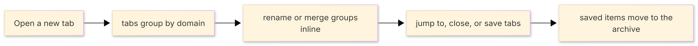

# Tabulor

**Keep tabs on your tabs.**

Tabulor is a Chrome extension that replaces your new tab page with a local dashboard that groups, renames, merges, and saves your open tabs — with a terminal-style view for those who like their dashboards sharp.

Light & dark themes. No server. No account. No external API calls. Just a Chrome extension.

---

## Install with a coding agent

Send your coding agent (Claude Code, Codex, etc.) this repo and say **"install this"**:

```
https://github.com/CaiShawn/tabulor
```

The agent will walk you through it. Takes about 1 minute.

---

## Features

### Core

- **Group by domain** — open tabs cluster by site; rename groups inline and they persist across sessions
- **Click to jump or close** — jump straight to any tab across windows, or close whole groups with one click
- **Save tabs for later** — a completion → archive flow with an in-dashboard list

### Highlights

- **Bookmark module** — the saved/archived column has search, a foldable header, and per-item restore or dismiss
- **Auto-merge same-named groups** — groups that share a label (custom or default) collapse into one card; hover the title to see every source domain
- **Two selectable visual styles** (Classic rounded / Terminal sharp + monospace) with system-aware light/dark palettes; toolbar icons match `prefers-color-scheme`
- **Self-contained** — self-hosted fonts and 100% local storage; no server, no account, no external API calls

---

## What's new

### v0.2.2

- **Archive redesign** — the saved/archived column gains a persisted foldable header, a search field that filters from a single character, and per-item **restore** / **dismiss** actions
- **Terminal-style saved-column scrollbar** — the archived column's scrollbar follows the active style so it reads as terminal chrome

### Roadmap

- **Group as the core data structure** — refactor the in-memory model so the group is the source of truth and the tab list is an input feed
- **Fix tag-delete group jumping** — keep the selected group in place during rapid consecutive tag deletions

---

## Manual Setup

**1. Clone the repo**

```bash
git clone https://github.com/CaiShawn/tabulor.git
```

**2. Load the Chrome extension**

1. Open Chrome and go to `chrome://extensions`
2. Enable **Developer mode** (top-right toggle)
3. Click **Load unpacked**
4. Navigate to the `extension/` folder inside the cloned repo and select it

**3. Open a new tab**

You'll see Tabulor.

---

## How it works



Everything runs inside the Chrome extension — no server, no API calls, no data sent anywhere. Your tabs, style, theme, and saved items live in `chrome.storage.local`.

---

## Tech stack

| What | How |
|------|-----|
| Extension | Chrome Manifest V3 |
| Storage | chrome.storage.local |
| Theming | CSS variables + `prefers-color-scheme`, per-style palette tokens |

---

## Inspired by

Tabulor is based on [tab-out](https://github.com/zarazhangrui/tab-out) by Zara Zhang (MIT) and inspired by [tab-harbor](https://github.com/V-IOLE-T/tab-harbor) by V-IOLE-T (MIT).

---

## License

MIT — see [`LICENSE`](./LICENSE).

Maintained by [CaiShawn](https://github.com/CaiShawn)